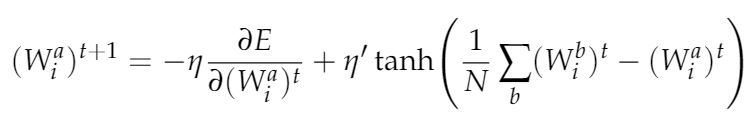

## How to save the gradient and optimize learning with Replicas

One of the main difficulties encountered in the learning process of deep neural networks is the so called "Vanishing Gradient" problem.
We will show that, having some knowledge of how the learning works, one can easily improve the learning rate of the first layers.

### The Space of Solutions

What's going on when a NN adjust its weights according to a Stochastic Gradient Descent algorithm?\\
What's really happening is that the the N dimensional space of all the weights is being searched for a minima of the cost function.
As it can be shown with some simulations, the space of solution contains some global minima, which are rare and hard to find, and a multitude of local minima.\\
Despite our first desire, we should not aim for the global one, since they actually generalize worse!
The local minima are our target, and luckily they share an amazing property: they come in clusters.\\
Having a cluster of shallow minima is everything we need: we can find them by replicating our sistem and analizing how minima overlap.
The narrow, deep global minima, wont overlap, where our cluster is shure to have some overlapping.

### A new learning rule

Having in mind everything said above, we can develop a new rule to update the weights. After some tedious math, which I skip here, we come to a modified equation for the update rule.



Let's test it!\\
This are some graphs of the cost and the learning rate of the layers for a NN with two layers


Markdown is a lightweight and easy-to-use syntax for styling your writing. It includes conventions for

```markdown
Syntax highlighted code block

# Header 1
## Header 2
### Header 3

- Bulleted
- List

1. Numbered
2. List

**Bold** and _Italic_ and `Code` text

[Link](url) and 
```

For more details see [GitHub Flavored Markdown](https://guides.github.com/features/mastering-markdown/).

### Jekyll Themes

Your Pages site will use the layout and styles from the Jekyll theme you have selected in your [repository settings](https://github.com/Fabbricatore/NN/settings). The name of this theme is saved in the Jekyll `_config.yml` configuration file.

### Support or Contact

Having trouble with Pages? Check out our [documentation](https://help.github.com/categories/github-pages-basics/) or [contact support](https://github.com/contact) and we’ll help you sort it out.
