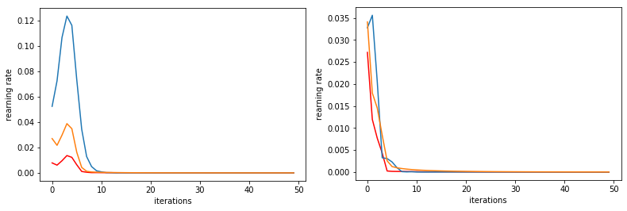

## How to save the gradient and optimize learning with Replicas

One of the main difficulties encountered in the learning process of deep neural networks is the so called "Vanishing Gradient" problem.
We will show that, having some knowledge of how the learning works, one can easily improve the learning rate of the first layers.

### The Space of Solutions

What's going on when a NN adjust its weights according to a Stochastic Gradient Descent algorithm?\\
What's really happening is that the the N dimensional space of all the weights is being searched for a minima of the cost function.
As it can be shown with some simulations, the space of solution contains some global minima, which are rare and hard to find, and a multitude of local minima.\\
Despite our first desire, we should not aim for the global one, since they actually generalize worse!
The local minima are our target, and luckily they share an amazing property: they come in clusters.\\
Having a cluster of shallow minima is everything we need: we can find them by replicating our sistem and analizing how minima overlap.
The narrow, deep global minima, wont overlap, where our cluster is shure to have some overlapping.

### A new learning rule

Having in mind everything said above, we can develop a new rule to update the weights. After some tedious math, which I skip here, we come to a modified equation for the update rule.


Let's test it!\\
Here are some graphs of the cost and the learning rate of the layers for a NN with two layers


Here we can compare the results with the old update rule (on the left) and with the new one (on the right)\\
The Cost is plotted in orange, the learning rate of the second layer is blue, and the first is red.\\
One can clearly see how the first layer improves its learning by at least an order

### Code

Here's the code I used to show the effect of the new algorithm.
It trains simultaniously 2 equal Networks, giving them different batch imputs.\\
Once the Forward is done, the weights are updatet according to the new rule.\\
Adding more replicas will result in an even bigger increase.

```ruby

import numpy as np
import matplotlib.pyplot as plt

#N is batch size; D_in is input dimension;
#H is hidden dimension; D_out is output dimension.
N, D_in, H, D_out = 64, 1000, 100, 10

#Save values
a=np.zeros(50)
b=np.zeros(50)
c=np.zeros(50)

#Data library
xx = np.random.randn(10*N, D_in)
yy = np.random.randn(10*N, D_out)

#Create random input and output data
x1 = np.random.randn(N, D_in)
y1 = np.random.randn(N, D_out)

x2 = np.random.randn(N, D_in)
y2 = np.random.randn(N, D_out)

#Randomly pick from library

for i in range(N):
    rnd1 = np.random.randint(N)
    rnd2 = np.random.randint(N)
    x1[i] = xx[rnd1]
    y1[i] = yy[rnd1]
    x2[i] = xx[rnd2]
    y2[i] = yy[rnd2]

#Randomly initialize weights
w11 = np.random.randn(D_in, H)
w12 = np.random.randn(H, D_out)

w21 = np.random.randn(D_in, H)
w22 = np.random.randn(H, D_out)

learning_rate = 1e-6
eta2=1


for t in range(50):
    
    #Forward 1
    h = x1.dot(w11)
    h_relu = np.maximum(h, 0)
    y_pred = h_relu.dot(w12)

    #Loss 1
    loss = np.square(y_pred - y1).sum()
    
    #Backprop 1
    grad_y_pred = 2.0 * (y_pred - y1)
    grad_w12 = h_relu.T.dot(grad_y_pred)
    grad_h_relu = grad_y_pred.dot(w12.T)
    grad_h = grad_h_relu.copy()
    grad_h[h < 0] = 0
    grad_w11 = x1.T.dot(grad_h)
    
    ####################################
    
    #Forward 2
    h = x2.dot(w21)
    h_relu = np.maximum(h, 0)
    y_pred = h_relu.dot(w22)

    
    #Backprop 2
    grad_y_pred = 2.0 * (y_pred - y2)
    grad_w22 = h_relu.T.dot(grad_y_pred)
    grad_h_relu = grad_y_pred.dot(w22.T)
    grad_h = grad_h_relu.copy()
    grad_h[h < 0] = 0
    grad_w21 = x2.T.dot(grad_h)
    
    ###################################

    #Update weights
    w11 -= learning_rate * grad_w11-eta2*np.tanh((w11+w21)/2-w11)
    w12 -= learning_rate * grad_w12-eta2*np.tanh((w12+w22)/2-w12)
    
    w21 -= learning_rate * grad_w21-eta2*np.tanh((w11+w21)/2-w21)
    w22 -= learning_rate * grad_w22-eta2*np.tanh((w12+w22)/2-w22)
    
    if t<50 :
        a[t]=abs(np.mean(learning_rate * grad_w11-eta2*np.tanh((w11+w21)/2-w11)))
        b[t]=abs(np.mean(learning_rate * grad_w12-eta2*np.tanh((w12+w22)/2-w12)))
        c[t]=loss
    
    
    

plt.plot(a*50,'r')
plt.plot(b)
plt.plot(c/1000000000)
plt.ylabel('rearning rate')
plt.xlabel(' iterations ')
plt.show()

print(w11[1,1])

```

